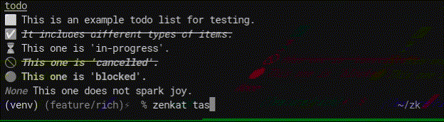

[](https://www.gnu.org/licenses/gpl-3.0) 

# ZenKat

ZenKat is a tool and library to enable using a set of plaintext files, especially markdown files, as a [Zettelkasten](https://en.wikipedia.org/wiki/Zettelkasten) knowledge base.

I've used a number of knowledge management tools including Obsidian, Notion, and Coda, and have found them all lacking and / or designed in a way that makes them act as a walled garden. ZenKat is an attempt to create a lightweight FOSS alternative for command-line users. As such it aims to have few dependencies while still providing decent features.

It's named this way because of my bad memory for German. I remembered ZEttelKAsTen as ZenKat (unclear where the N came from).



## Recommended Setup

You can install directly from pip:

```
pip install zenkat
```

This also installs the `zenkat` convenience script.

To configure themes and create custom queries and formats, make a file at `~/.config/zenkat/config.toml`.

If you'd like to run directly from source you can clone the repository and use [development mode](https://setuptools.pypa.io/en/latest/userguide/development_mode.html).

It's also worth installing [Marksman LSP](https://github.com/artempyanykh/marksman) if you plan on working with plaintext files a lot. This should work with major CLI editors including Helix, Neovim, and Spacemacs, as well as KATE. I use Helix.

For viewing files as formatted you can use [MD Fileserver]( https://github.com/commenthol/md-fileserver ) with `mdstart`.

`diff` comes by default on the command line and can be extremely helpful when combining duplicate notes (which Obsidian's multiple vaults tend to lead to).

## Features

- Filter and sort through notes with powerful mapping syntax
- Customisable output formats and color schemes
- Supports markdown tags, and unpacks nested tags
- Resolves internal links, both inbound and outbound
- Loads YAML metadata headers in pages
- Task tracking with beautiful formatting, filters, and extended syntax

## Usage

ZenKat supports a number of operations based on the fields it indexes. As of version v0.0.10 it indexes documents, links, list items, and tags and can recursively access properties. You can customise the output using `--format`.

```
zenkat list pages --filter "tags.name has writing" --format "{rel_path} {tags.name}"
```

One of the most powerful features of ZenKat is the ability to calculate backlinks and resolve paths:
```
zenkat list pages --sort "in_link_count asc"
```

It can correctly operate over dates using filters.

```
zenkat list pages --filter "created_at > Sep 25 2023"
```

You can also combine multiple filters, which will act like an AND statement.

```
zenkat list pages --filter "rel_path has business" --filter "rel_path has Client"
```

You can sort by fields using straightforward ascending / descending statements. Note that you can only sort on one field at the moment.

```
zenkat list pages --filter "rel_path has business" --sort "modified_at asc" --format "{modified_at} {filename}"
```

You can get a simple list of tags and then find which pages have those tags:

```
zenkat list tags
zenkat list pages --filter "any tags.name = daily"
```

You can access subfields recursively in most commands:
```
zenkat list pages --format "{title} {tags.0.name}"
```

You can keep track of your tasks and filter your todo lists:
```
zenkat tasks --filter "status ~ done"
```

You can quickly check document formatting:
```
zenkat cat README.md
```

### Fields and Subfields

Most properties (in dicts / objects) can be queried using normal field syntax. For lists of dictionaries or objects, this will map the property of the list items to the parent list.
```
metadata.name # return a string
tags.name # return a list of tag names
```

Specific list items can also be accessed using their index.
```
tags.0
```

For dealing with nested arrays you can use the * (reduce) operator:

```
lists.*.text
```


#### Pages
```python
title: str # filename without extensions
filename: str
abs_path: str
rel_path: str
created_at: datetime
modified_at: datetime
tags: list[Tag]
out_links: list[Link] # external links are not indexed for now
out_link_count: int
in_links: list[Link]
in_link_count: int
word_count: int
metadata: dict
headings: list[Heading]
outline: str
lists: list[list[ListItem]]
```

#### Heading

```python
text: str
depth: int
children: list # not in use
```

#### Tags

```python
name: str
count: int
docs: str[str] # absolute paths of source documents
```

#### ListItem

```python
text: str
depth: int # indent level
type: str
status: Union[str,None]
children: list # not used
doc_abs_path: str
```

#### Links

```python
text: str
href: str # the exact text of the link
href_resolved: str
doc_title: str
doc_abs_path: str
type: str # wiki or regular
```

### Formatting

You can format the output of zenkat by using a format string in Python format. Note that this no longer uses `.format()` but instead uses regexps to support subfields.

```
zenkat list pages --format "[↓{in_link_count} ↑{out_link_count}] {title}, {word_count} words ({rel_path})"

zenkat list links --format "{doc_abs_path} → {href_resolved}"
```

As of v0.0.10 formatting can make use of subfields of pages correctly in the same way as filter.

```
zenkat list pages --format "{title} {rel_path} {out_links.text} {in_links.doc_abs_path}"
```

As of v0.1 zenkat supports rich text using [the rich library](https://github.com/Textualize/rich). You can include rich tags in your format arguments. For example, this is the default page format:

```
[info][↓{in_link_count} ↑{out_link_count}][/info] [main]{title}[/main], [sub]{word_count} words ([link]{rel_path}[/link])[/sub]
```

The formatting for semantic tags like `[info]` and `[link]` can be edited in `config.toml` under `[theme.colors]`. The `/themes` folder of this repository gives some examples (feel free to contribute more!). For example, here's my favorite, monokai:

```toml
[theme.colors]
comment = "#797979"
white = "#d6d6d6"
yellow = "#e5b567"
green = "#b4d273"
orange = "#e87d3e"
purple = "#9e86c8"
pink = "#b05279"
blue = "#6c99bb"

alert = "#e5b567 bold"
info = "#e87d3e bold"
info2 = "#e5b567"
link = "#b4d273 underline"
main = "#d6d6d6 bold"
sub = "#d6d6d6"
status = "#b05279 bold"
```

As of v0.1 zenkat also supports shortcuts for formats with the `-F` flag. You can create these in `config.toml`.

```
# in config.toml
[formats]
outline = [info]{title}[/info]\n{outline}

# on the command line
zenkat list pages -F outline
```

Default options for `list` can also be configured:

```toml
[formats.default.list]
pages = "[info][↓{in_link_count} ↑{out_link_count}][/info] [main]{title}[/main], [sub]{word_count} words ([link]{rel_path}[/link])[/sub]"
links = "[link]{doc_abs_path}[/link] → [link]{href_resolved}[/link]"
tags = "[info][{count} pages][/info] [main]{name}[/main]"
list_items = "[link]{doc_title}[/link]\n[info]({type})[/info] {text}"
```

### Filters

Currently filters use a basic token structure, separated by spaces. The last argument can be multiple words long. The format of filters is:

```
any tags.name = writing
[all | any] field[.subfield*] operation value
```

Subfields become lists which can be queried by using the `any` and `all` keywords. (Effectively, the `.` is a map command).

```
any tags.name = writing
```

As of v0.0.10 `dateutil` is used to parse dates, meaning most date strings will work as expected.

```
created_at < 2023-10
created_at > Jun 2023
created_at > September 10, 2023
```

Operations currently supported are:

```
=
~=
>
<
>=
<=
has (in with reversed direction, works on sets, lists, strings, and dicts)
~has (opposite of has)
```

### Sorting

You can sort by any non-compound field using the following syntax.

```
<FIELD> {asc / desc}
modified_at asc
```

### Tasks

As of v0.1 zenkat supports task lists similar to the [Obsidian Tasks Plugin](https://github.com/obsidian-tasks-group/obsidian-tasks), albeit more limited.
```
zenkat tasks --filter "status = not done" --page "tags.name has business"
```

By default, all tasks from all pages are included. The `--filter` flag filters on task ListItems, while the `--page` flag filters on source pages.

You can configure the appearance of tasks in `config.toml`:

```toml
[tasks.symbols]
done = "✅"
not_done = "⬜"
in_progress = "⏳"
cancelled = "🚫"
blocked = "🔴"

[tasks.tags]
# need to specify opening and closing tags
done = ["[strike][i]","[/i][/strike]"]
cancelled = ["[alert][strike][i]","[/i][/strike][/alert]"]
blocked = ["[alert]","[/alert]"]
```

### Queries

From v0.1 zenkat supports queries in ZQL (Zen Query Language), a simple query language similar to SQL. For example:

```
list pages {lists.*.text}
where any lists.*.text has business
sort asc
```

There are two ways to use query syntax from the CLI. The first is directly with the -q flag:

```
zenkat query -q "list pages {lists.*.text} where any lists.*.text has business"
```

However this can be verbose, so the default behaviour is to load from config and use these as macros:

```
# in config.toml
[queries]
reduce_test = "list pages {lists.*.text} where any lists.*.text has business"

# on the command line
zenkat query reduce_test
```

The current syntax of the query language (not accounting for edge cases) is:

```
list COLLECTION [FORMAT]
[where [all | any] FIELD[.SUBFIELD*] OP EXPR]
[sort FIELD[.SUBFIELD*] ASC | DESC]
```

